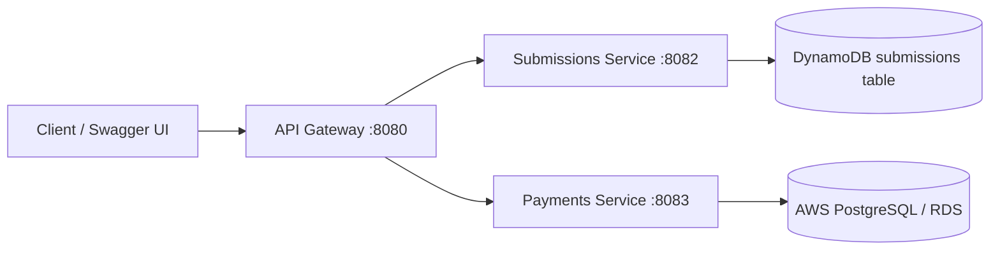

# Laundry Microservices Example

A small Spring Boot microservices demo built around an API gateway, JWT authentication, Swagger/OpenAPI, and AWS-backed microservices.

I used an API Gateway as the single entry point for the frontend. It handled routing requests to the appropriate Spring Boot microservice, while authentication and authorization were handled using JWT. The individual services were responsible for their own business logic and persistence: submissions use DynamoDB, payments use PostgreSQL on AWS, and the stack runs on EC2 in AWS. We can then independently deploy and scale services such as submissions and payments.

### Demo
https://laundry-isxy.onrender.com/swagger-ui/index.html

## Overview



The gateway issues and validates JWT tokens, then forwards requests to downstream services. The submissions service stores data in DynamoDB, while the payments service uses PostgreSQL on AWS. Each service exposes its own Swagger UI.

## Services

| Service | Port | Purpose |
| --- | --- | --- |
| Gateway | 8080 | Authenticates JWT and routes requests |
| Submissions service | 8082 | Manages submissions |
| Payments service | 8083 | Manages payments |

## AWS services used

This project is designed to run on AWS using a simple cloud-native deployment model:

- Amazon DynamoDB for submissions persistence
- Amazon RDS for PostgreSQL for the payments service
- Amazon EC2 for hosting the gateway and microservices
- AWS IAM for instance permissions and least-privilege access
- Amazon VPC Security Groups for ingress control
- Application Load Balancer (ALB) for optional HTTPS/public routing
- Amazon Route 53 and ACM for custom domain + TLS when enabled
- AWS CloudFormation scripts for infrastructure provisioning

## Features

- Spring Boot 4.1.0
- Spring Security for JWT-protected gateway routes
- Springdoc OpenAPI / Swagger UI on all services
- AWS SDK v2 DynamoDB Enhanced Client for submissions persistence
- Spring Data JPA with PostgreSQL for payments persistence
- Docker and Docker Compose support

## Prerequisites

- Java 21 for the gateway
- Java 17 for the downstream services
- Maven Wrapper (`./mvnw`)
- Docker and Docker Compose if you want to run the stack in containers

## Run Locally

Start each service in a separate terminal.

Gateway:

```bash
./mvnw -f microservices/gateway/pom.xml spring-boot:run
```

Submissions service:

```bash
./mvnw -f microservices/submissions-service/pom.xml spring-boot:run
```

Payments service:

```bash
./mvnw -f microservices/payments-service/pom.xml spring-boot:run
```

## Run With Docker

Build the service jars first, then start everything with Compose:

```bash
./mvnw -f microservices/submissions-service/pom.xml -DskipTests package
./mvnw -f microservices/payments-service/pom.xml -DskipTests package
./mvnw -f microservices/gateway/pom.xml -DskipTests package
docker-compose up --build
```

## Swagger URLs

- Gateway: http://localhost:8080/swagger-ui.html
- Submissions service: http://localhost:8082/swagger-ui.html
- Payments service: http://localhost:8083/swagger-ui.html

OpenAPI JSON is available at `/v3/api-docs` on each service.

## API Flow

1. Request a JWT from the gateway.
2. Call the gateway routes with `Authorization: Bearer <token>`.
3. The gateway validates the token and forwards the request.
4. The downstream service stores or returns data from its respective backing store: DynamoDB for submissions and PostgreSQL for payments.

## Get a JWT

```bash
curl "http://localhost:8080/auth/token?userId=alice&role=user"
```

## Sample Requests

Create a token variable:

```bash
TOKEN=$(curl -s "http://localhost:8080/auth/token?userId=alice&role=user" | sed -E 's/.*"token":"([^"]+)".*/\1/')
```

Create a submission:

```bash
curl -X POST "http://localhost:8080/api/submissions" \
  -H "Authorization: Bearer $TOKEN" \
  -H "Content-Type: application/json" \
  -d '{"title":"Gateway submission"}'
```

List submissions:

```bash
curl -X GET "http://localhost:8080/api/submissions" \
  -H "Authorization: Bearer $TOKEN"
```

Create a payment locally:

```bash
curl -X POST "http://localhost:8080/api/payments" \
  -H "Authorization: Bearer $TOKEN" \
  -H "Content-Type: application/json" \
  -d '{"amount":39.99,"currency":"USD"}'
```

List payments locally:

```bash
curl -X GET "http://localhost:8080/api/payments" \
  -H "Authorization: Bearer $TOKEN"
```

Create a payment in AWS production:

```bash
TOKEN=$(curl -s "https://api.laundrywithme.com/auth/token?userId=alice&role=user" | sed -E 's/.*"token":"([^"]+)".*/\1/')

curl -X POST "https://api.laundrywithme.com/api/payments" \
  -H "Authorization: Bearer $TOKEN" \
  -H "Content-Type: application/json" \
  -d '{"amount":39.99,"currency":"USD"}'
```

List payments in AWS production:

```bash
curl -X GET "https://api.laundrywithme.com/api/payments" \
  -H "Authorization: Bearer $TOKEN"
```

If you are testing without JWT, the gateway also accepts the forwarded headers pattern used in local debugging:

```bash
curl -sS -X GET "https://api.laundrywithme.com/api/payments" \
  -H "X-User-Id: user-123" \
  -H "X-User-Role: USER"
```

## Gateway Routes

- `GET /auth/token` returns a signed JWT
- `GET /api/submissions` lists submissions
- `POST /api/submissions` creates a submission
- `GET /api/payments` lists payments
- `POST /api/payments` creates a payment

## Notes

- JWT validation happens in the gateway, not in the downstream services.
- The gateway forwards `X-User-Id` and `X-User-Role` headers.
- Submissions are persisted in DynamoDB, while payments use PostgreSQL.
- If ports 8080, 8082, or 8083 are already in use, stop the running process before starting the services again.

## Deploy on AWS (EC2 + DynamoDB + PostgreSQL)

This repository includes scripts in `deploy/aws` to provision AWS resources and run the microservices stack on an EC2 host using Docker Compose. The submissions service uses DynamoDB, while the payments service connects to PostgreSQL on AWS.

### Option A: CloudFormation (recommended)

Use CloudFormation to create/update DynamoDB tables and generate a reusable IAM managed policy for the EC2 role.

```bash
cp deploy/aws/.env.aws.example .env.aws
source .env.aws
chmod +x deploy/aws/deploy-cloudformation.sh
./deploy/aws/deploy-cloudformation.sh
```

Template path: `deploy/aws/dynamodb-stack.yaml`

Outputs include:

- Submissions table name
- Payments table name
- IAM managed policy ARN to attach to your EC2 role

### 1) Launch an EC2 instance

- Use Amazon Linux 2023 (or Ubuntu 22.04+).
- Attach an IAM role with at least DynamoDB permissions for:
  - `dynamodb:DescribeTable`
  - `dynamodb:CreateTable`
  - `dynamodb:PutItem`
  - `dynamodb:Scan`
- Open inbound ports `22`, `8080`, `8082`, and `8083` in the EC2 security group.

### 2) Install Docker + Compose + AWS CLI on EC2

Example for Amazon Linux 2023:

```bash
sudo dnf update -y
sudo dnf install -y docker awscli git
sudo systemctl enable --now docker
sudo usermod -aG docker ec2-user
sudo curl -L https://github.com/docker/compose/releases/download/v2.29.7/docker-compose-linux-x86_64 -o /usr/local/bin/docker-compose
sudo chmod +x /usr/local/bin/docker-compose
newgrp docker
```

Note: On some Amazon Linux 2023 images, `docker compose` plugin is not preinstalled, so this project uses the standalone `docker-compose` binary.

### 3) Clone the repo and configure environment

```bash
git clone <your-repo-url>
cd laundry
cp deploy/aws/.env.aws.example .env.aws
```

Edit `.env.aws` and set a strong `SECURITY_JWT_SECRET`.

### Git ignore for AWS deploy files

This repository ignores local deployment secrets by default:

- `.env.aws`
- `deploy/aws/keys/`
- `*.pem`

Keep using `deploy/aws/.env.aws.example` as the committed template.

### 4) Provision DynamoDB tables

```bash
chmod +x deploy/aws/provision-dynamodb.sh
source .env.aws
./deploy/aws/provision-dynamodb.sh
```

You can skip this step if you already used the CloudFormation option above.

### Option B: One-shot CloudFormation (EC2 + IAM + SG + DynamoDB)

Use this option to provision infrastructure and boot the app automatically in one stack.

What this stack creates:

- DynamoDB submissions/payments tables
- EC2 role with least-privilege DynamoDB access
- EC2 instance profile
- Security group (ports 22, 8080, 8082, 8083)
- EC2 host with Docker, cloned repo, and running `docker compose`

Optional when configured:

- Application Load Balancer (ALB)
- HTTPS listener with ACM certificate
- Route53 alias record for your domain

Run:

```bash
cp deploy/aws/.env.aws.example .env.aws
# Edit .env.aws and set: EC2_KEY_PAIR_NAME, GIT_REPO_URL, SECURITY_JWT_SECRET
chmod +x deploy/aws/deploy-full-stack.sh
./deploy/aws/deploy-full-stack.sh
```

Template path: `deploy/aws/full-stack-ec2.yaml`

To enable custom domain + HTTPS, set these variables in `.env.aws` before deploy:

- `ENABLE_ALB_HTTPS=true`
- `VPC_ID=<your-vpc-id>`
- `PUBLIC_SUBNET_ONE_ID=<public-subnet-1>`
- `PUBLIC_SUBNET_TWO_ID=<public-subnet-2>`
- `ACM_CERTIFICATE_ARN=<acm-cert-arn>`
- `CUSTOM_DOMAIN_NAME=<api.yourdomain.com>`
- `HOSTED_ZONE_ID=<route53-hosted-zone-id>`

Then deploy the same way:

```bash
./deploy/aws/deploy-full-stack.sh
```

When enabled, CloudFormation outputs include `AlbDnsName` and `HttpsDomainUrl`.

After stack creation, retrieve outputs to get the public IP and gateway URL:

```bash
aws cloudformation describe-stacks \
  --region "$AWS_REGION" \
  --stack-name "$CF_FULL_STACK_NAME" \
  --query 'Stacks[0].Outputs' \
  --output table
```

### 5) Build and run services

```bash
chmod +x deploy/aws/deploy-ec2.sh
./deploy/aws/deploy-ec2.sh
```

### 6) Access the application

- Gateway Swagger UI: `http://<ec2-public-ip>:8080/swagger-ui.html`
- Submissions Swagger UI: `http://<ec2-public-ip>:8082/swagger-ui.html`
- Payments Swagger UI: `http://<ec2-public-ip>:8083/swagger-ui.html`


pids=$(lsof -ti tcp:8082); if [[ -n "$pids" ]]; then kill -9 $pids; fi; cd microservices/submissions-service && ../../mvnw spring-boot:run
