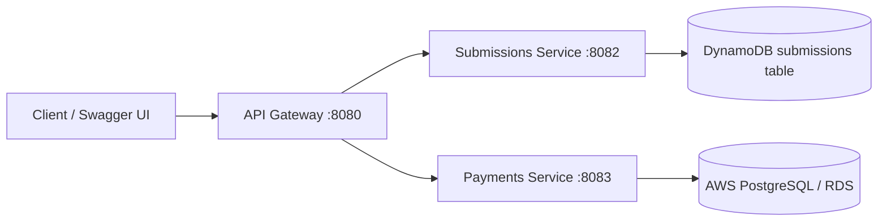
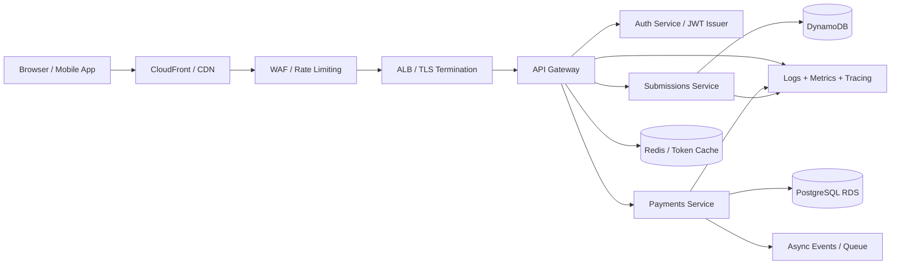

# Laundry Microservices Example

A small Spring Boot microservices demo built around an API gateway, JWT authentication, Swagger/OpenAPI, and AWS-backed microservices.

I used an API Gateway as the single entry point for the frontend. It handled routing requests to the appropriate Spring Boot microservice, while authentication and authorization were handled using JWT. The individual services were responsible for their own business logic and persistence: submissions use DynamoDB, payments use PostgreSQL on AWS, and the stack runs on EC2 in AWS. We can then independently deploy and scale services such as submissions and payments.

### Demo
https://laundry-isxy.onrender.com/swagger-ui/index.html

## Overview



The gateway issues and validates JWT tokens, then forwards requests to downstream services. The submissions service stores data in DynamoDB, while the payments service uses PostgreSQL on AWS. Each service exposes its own Swagger UI.

## Services

| Service | Port | Purpose |
| --- | --- | --- |
| Gateway | 8080 | Authenticates JWT and routes requests |
| Submissions service | 8082 | Manages submissions |
| Payments service | 8083 | Manages payments |

## AWS services used

This project is designed to run on AWS using a simple cloud-native deployment model:

- Amazon DynamoDB for submissions persistence
- Amazon RDS for PostgreSQL for the payments service
- Amazon EC2 for hosting the gateway and microservices
- AWS IAM for instance permissions and least-privilege access
- Amazon VPC Security Groups for ingress control
- Application Load Balancer (ALB) for optional HTTPS/public routing
- Amazon Route 53 and ACM for custom domain + TLS when enabled
- AWS CloudFormation scripts for infrastructure provisioning

## Features

- Spring Boot 4.1.0
- Spring Security for JWT-protected gateway routes
- Springdoc OpenAPI / Swagger UI on all services
- AWS SDK v2 DynamoDB Enhanced Client for submissions persistence
- Spring Data JPA with PostgreSQL for payments persistence
- Docker and Docker Compose support

## Prerequisites

- Java 21 for the gateway
- Java 17 for the downstream services
- Maven Wrapper (`./mvnw`)
- Docker and Docker Compose if you want to run the stack in containers

## Run Locally

Start each service in a separate terminal.

Gateway:

```bash
./mvnw -f microservices/gateway/pom.xml spring-boot:run
```

Submissions service:

```bash
./mvnw -f microservices/submissions-service/pom.xml spring-boot:run
```

Payments service:

```bash
./mvnw -f microservices/payments-service/pom.xml spring-boot:run
```

## Run With Docker

Build the service jars first, then start everything with Compose:

```bash
./mvnw -f microservices/submissions-service/pom.xml -DskipTests package
./mvnw -f microservices/payments-service/pom.xml -DskipTests package
./mvnw -f microservices/gateway/pom.xml -DskipTests package
docker-compose up --build
```

## Swagger URLs

Local:

- Gateway: http://localhost:8080/swagger-ui.html
- Submissions service: http://localhost:8082/swagger-ui.html
- Payments service: http://localhost:8083/swagger-ui.html

Production:

- ALB gateway: https://laundry-alb-1703016127.us-east-1.elb.amazonaws.com/swagger-ui/index.html
- Custom domain gateway: https://api.laundrywithme.com/swagger-ui/index.html

OpenAPI JSON is available at `/v3/api-docs` on each service.

## API Flow

1. Request a JWT from the gateway.
2. Call the gateway routes with `Authorization: Bearer <token>`.
3. The gateway validates the token and forwards the request.
4. The downstream service stores or returns data from its respective backing store: DynamoDB for submissions and PostgreSQL for payments.

## Get a JWT

```bash
curl "http://localhost:8080/auth/token?userId=alice&role=user"
```

## Sample Requests

Create a token variable:

```bash
TOKEN=$(curl -s "http://localhost:8080/auth/token?userId=alice&role=user" | sed -E 's/.*"token":"([^"]+)".*/\1/')
```

Create a submission:

```bash
curl -X POST "http://localhost:8080/api/submissions" \
  -H "Authorization: Bearer $TOKEN" \
  -H "Content-Type: application/json" \
  -d '{"title":"Gateway submission"}'
```

List submissions:

```bash
curl -X GET "http://localhost:8080/api/submissions" \
  -H "Authorization: Bearer $TOKEN"
```

Create a payment locally:

```bash
curl -X POST "http://localhost:8080/api/payments" \
  -H "Authorization: Bearer $TOKEN" \
  -H "Content-Type: application/json" \
  -H "Idempotency-Key: $(uuidgen)" \
  -d '{"amount":39.99,"currency":"USD"}'
```

List payments locally:

```bash
curl -X GET "http://localhost:8080/api/payments" \
  -H "Authorization: Bearer $TOKEN"
```

Create a payment in AWS production:

```bash
TOKEN=$(curl -s "https://api.laundrywithme.com/auth/token?userId=alice&role=user" | sed -E 's/.*"token":"([^"]+)".*/\1/')

curl -sS -D - -o /tmp/payment.out \
  -X POST "https://api.laundrywithme.com/api/payments" \
  -H "Authorization: Bearer $TOKEN" \
  -H "Content-Type: application/json" \
  -H "Idempotency-Key: $(uuidgen)" \
  -d '{"amount":39.99,"currency":"USD"}'
```

List payments in AWS production:

```bash
curl -X GET "https://api.laundrywithme.com/api/payments" \
  -H "Authorization: Bearer $TOKEN"
```

If you are testing without JWT, the gateway also accepts the forwarded headers pattern used in local debugging:

```bash
curl -sS -X GET "https://api.laundrywithme.com/api/payments" \
  -H "X-User-Id: user-123" \
  -H "X-User-Role: USER"
```

## Gateway Routes

- `GET /auth/token` returns a signed JWT
- `GET /api/submissions` lists submissions
- `POST /api/submissions` creates a submission
- `GET /api/payments` lists payments
- `POST /api/payments` creates a payment

## Notes

- JWT validation happens in the gateway, not in the downstream services.
- The gateway forwards `X-User-Id` and `X-User-Role` headers.
- Submissions are persisted in DynamoDB, while payments use PostgreSQL.
- If ports 8080, 8082, or 8083 are already in use, stop the running process before starting the services again.

## Deploy on AWS (EC2 + DynamoDB + PostgreSQL)

This repository includes scripts in `deploy/aws` to provision AWS resources and run the microservices stack on an EC2 host using Docker Compose. The submissions service uses DynamoDB, while the payments service connects to PostgreSQL on AWS.

### Option A: CloudFormation (recommended)

Use CloudFormation to create/update DynamoDB tables and generate a reusable IAM managed policy for the EC2 role.

```bash
cp deploy/aws/.env.aws.example .env.aws
source .env.aws
chmod +x deploy/aws/deploy-cloudformation.sh
./deploy/aws/deploy-cloudformation.sh
```

Template path: `deploy/aws/dynamodb-stack.yaml`

Outputs include:

- Submissions table name
- Payments table name
- IAM managed policy ARN to attach to your EC2 role

### 1) Launch an EC2 instance

- Use Amazon Linux 2023 (or Ubuntu 22.04+).
- Attach an IAM role with at least DynamoDB permissions for:
  - `dynamodb:DescribeTable`
  - `dynamodb:CreateTable`
  - `dynamodb:PutItem`
  - `dynamodb:Scan`
- Open inbound ports `22`, `8080`, `8082`, and `8083` in the EC2 security group.

### 2) Install Docker + Compose + AWS CLI on EC2

Example for Amazon Linux 2023:

```bash
sudo dnf update -y
sudo dnf install -y docker awscli git
sudo systemctl enable --now docker
sudo usermod -aG docker ec2-user
sudo curl -L https://github.com/docker/compose/releases/download/v2.29.7/docker-compose-linux-x86_64 -o /usr/local/bin/docker-compose
sudo chmod +x /usr/local/bin/docker-compose
newgrp docker
```

Note: On some Amazon Linux 2023 images, `docker compose` plugin is not preinstalled, so this project uses the standalone `docker-compose` binary.

### 3) Clone the repo and configure environment

```bash
git clone <your-repo-url>
cd laundry
cp deploy/aws/.env.aws.example .env.aws
```

Edit `.env.aws` and set a strong `SECURITY_JWT_SECRET`.

### Git ignore for AWS deploy files

This repository ignores local deployment secrets by default:

- `.env.aws`
- `deploy/aws/keys/`
- `*.pem`

Keep using `deploy/aws/.env.aws.example` as the committed template.

### 4) Provision DynamoDB tables

```bash
chmod +x deploy/aws/provision-dynamodb.sh
source .env.aws
./deploy/aws/provision-dynamodb.sh
```

You can skip this step if you already used the CloudFormation option above.

### Option B: One-shot CloudFormation (EC2 + IAM + SG + DynamoDB)

Use this option to provision infrastructure and boot the app automatically in one stack.

What this stack creates:

- DynamoDB submissions/payments tables
- EC2 role with least-privilege DynamoDB access
- EC2 instance profile
- Security group (ports 22, 8080, 8082, 8083)
- EC2 host with Docker, cloned repo, and running `docker compose`

Optional when configured:

- Application Load Balancer (ALB)
- HTTPS listener with ACM certificate
- Route53 alias record for your domain

Run:

```bash
cp deploy/aws/.env.aws.example .env.aws
# Edit .env.aws and set: EC2_KEY_PAIR_NAME, GIT_REPO_URL, SECURITY_JWT_SECRET
chmod +x deploy/aws/deploy-full-stack.sh
./deploy/aws/deploy-full-stack.sh
```

Template path: `deploy/aws/full-stack-ec2.yaml`

To enable custom domain + HTTPS, set these variables in `.env.aws` before deploy:

- `ENABLE_ALB_HTTPS=true`
- `VPC_ID=<your-vpc-id>`
- `PUBLIC_SUBNET_ONE_ID=<public-subnet-1>`
- `PUBLIC_SUBNET_TWO_ID=<public-subnet-2>`
- `ACM_CERTIFICATE_ARN=<acm-cert-arn>`
- `CUSTOM_DOMAIN_NAME=<api.yourdomain.com>`
- `HOSTED_ZONE_ID=<route53-hosted-zone-id>`

Then deploy the same way:

```bash
./deploy/aws/deploy-full-stack.sh
```

When enabled, CloudFormation outputs include `AlbDnsName` and `HttpsDomainUrl`.

After stack creation, retrieve outputs to get the public IP and gateway URL:

```bash
aws cloudformation describe-stacks \
  --region "$AWS_REGION" \
  --stack-name "$CF_FULL_STACK_NAME" \
  --query 'Stacks[0].Outputs' \
  --output table
```

### 5) Build and run services

```bash
chmod +x deploy/aws/deploy-ec2.sh
./deploy/aws/deploy-ec2.sh
```

### Production deployment on EC2 + RDS

Use the AWS env file when you are deploying the stack in production. This file should contain the real PostgreSQL RDS endpoint and credentials for the payments service.

```bash
cp deploy/aws/.env.aws.example .env.aws
```

Then update `.env.aws` with the live values:

```bash
PAYMENTS_DATASOURCE_URL=jdbc:postgresql://laundry-payments.<region>.rds.amazonaws.com:5432/payments
PAYMENTS_DATASOURCE_USERNAME=payments
PAYMENTS_DATASOURCE_PASSWORD=<strong-password>
SERVICES_PAYMENTS_URL=http://payments-service:8083
SECURITY_JWT_SECRET=<strong-32-byte-secret>
```

Start the production stack on the EC2 host:

```bash
docker compose --env-file .env.aws up -d --build
```

Check the running services:

```bash
docker compose --env-file .env.aws ps
```

Verify the payments service is healthy and listening:

```bash
docker compose --env-file .env.aws logs payments-service --tail=200
```

Test the production gateway with a JWT token:

```bash
TOKEN=$(curl -s "https://api.laundrywithme.com/auth/token?userId=alice&role=user" | sed -E 's/.*"token":"([^"]+)".*/\1/')
```

Then create a payment through the public gateway:

```bash
curl -sS -D - -o /tmp/payment.out \
  -X POST "https://api.laundrywithme.com/api/payments" \
  -H "Authorization: Bearer $TOKEN" \
  -H "Content-Type: application/json" \
  -H "Idempotency-Key: $(uuidgen)" \
  -d '{"amount":39.99,"currency":"USD"}'
```

List payments through the public gateway:

```bash
curl -X GET "https://api.laundrywithme.com/api/payments" \
  -H "Authorization: Bearer $TOKEN"
```

If you need to test without the JWT flow during a debugging pass, the gateway also accepts forwarded headers:

```bash
curl -sS -X GET "https://api.laundrywithme.com/api/payments" \
  -H "X-User-Id: user-123" \
  -H "X-User-Role: USER"
```

### 6) Access the application

- Gateway Swagger UI: `http://<ec2-public-ip>:8080/swagger-ui.html`
- Submissions Swagger UI: `http://<ec2-public-ip>:8082/swagger-ui.html`
- Payments Swagger UI: `http://<ec2-public-ip>:8083/swagger-ui.html`

### RDS access mode: secure private setup vs public test setup

This project defaults to the secure AWS pattern: keep PostgreSQL in a private subnet and let the EC2 app instance reach it from inside the same VPC.

Recommended secure default:

```dotenv
RDS_PUBLICLY_ACCESSIBLE=false
RDS_ALLOWED_CIDR=10.0.0.0/16
```

CloudFormation equivalent:

```yaml
PubliclyAccessible: 'false'
```

This keeps the database off the public internet while allowing the EC2 app host or VPC CIDR to connect on port 5432.

Only use the public option for testing or a temporary demo setup:

```dotenv
RDS_PUBLICLY_ACCESSIBLE=true
RDS_ALLOWED_CIDR=0.0.0.0/0
```

CloudFormation equivalent:

```yaml
PubliclyAccessible: 'true'
```

This is intentionally less secure because the database becomes reachable from the internet. Use it only when you deliberately want public DB access and are comfortable with the higher exposure.

### Deploy and verify after a change

#### Deploy code changes to production EC2

When you've made code changes and want to deploy to production:

```bash
# 1. Get your EC2 instance IP
source .env.aws
EC2_IP=$(aws ec2 describe-instances \
  --region "$AWS_REGION" \
  --filters "Name=instance-state-name,Values=running" \
  --query 'Reservations[0].Instances[0].PublicIpAddress' \
  --output text)

# 2. SSH into your EC2 instance
ssh -i deploy/aws/keys/${EC2_KEY_PAIR_NAME}.pem ec2-user@$EC2_IP

# 3. Once on the EC2 instance, pull the latest code
cd laundry
git fetch origin
git reset --hard origin/main

# 4. Ensure .env.aws has the production configuration
# Add API_BASE_URL if not present:
grep -q "^API_BASE_URL=" .env.aws || echo "API_BASE_URL=https://api.laundrywithme.com" >> .env.aws

# 5. Rebuild and restart services (choose one option below)

# Option A: Restart just the gateway (fastest)
docker-compose --env-file .env.aws up -d --build gateway

# Option B: Restart all services
docker-compose --env-file .env.aws up -d --build

# 6. Check service status
docker-compose --env-file .env.aws ps

# 7. Check logs if needed
docker-compose --env-file .env.aws logs gateway --tail=50
```

#### Deploy infrastructure changes

Deploy the secure RDS stack:

```bash
cd /Users/francojacobo/Downloads/laundry
source .env.aws
./deploy/aws/deploy-rds-postgres.sh
```

Deploy or update DynamoDB tables:

```bash
./deploy/aws/provision-dynamodb.sh
```

Verify submissions:

```bash
TOKEN=$(curl -sS 'https://api.laundrywithme.com/auth/token?userId=alice&role=user' | sed -E 's/.*"token":"([^"]+)".*/\1/')

curl -sS -X POST 'https://api.laundrywithme.com/api/submissions' \
  -H "Authorization: Bearer $TOKEN" \
  -H 'Content-Type: application/json' \
  -d '{"title":"Gateway submission"}'

curl -sS -H "Authorization: Bearer $TOKEN" \
  'https://api.laundrywithme.com/api/submissions'
```

Verify payments:

```bash
TOKEN=$(curl -sS 'https://api.laundrywithme.com/auth/token?userId=alice&role=user' | sed -E 's/.*"token":"([^"]+)".*/\1/')

curl -sS -D - -o /tmp/payment.out \
  -X POST 'https://api.laundrywithme.com/api/payments' \
  -H "Authorization: Bearer $TOKEN" \
  -H 'Content-Type: application/json' \
  -H "Idempotency-Key: $(uuidgen)" \
  -d '{"amount":39.99,"currency":"USD"}'

curl -sS -H "Authorization: Bearer $TOKEN" \
  'https://api.laundrywithme.com/api/payments'
```

## Part 2: Production Readiness and System Design

### Production readiness assessment

This project is a strong microservice proof of concept, but it is not yet production-ready as-is. The main strengths are the service separation, JWT-based gateway authentication, and clear infrastructure boundaries between submissions and payments. The main gaps are around security hardening, browser compatibility, and operational resilience.

### What is already in place

- Clear gateway, submissions, and payments boundaries
- JWT-based authentication at the API gateway
- Separate backing stores for each service
- Dockerized deployment flow
- AWS infrastructure scripts for EC2, DynamoDB, and PostgreSQL setup

### Gaps before production

1. CORS is not configured explicitly for browser clients
   - Without a proper CORS policy, frontend apps running on a different domain or port will be blocked by the browser.
   - A browser-safe gateway must allow only trusted origins and required HTTP methods.

2. Security headers are not hardened
   - Add `X-Frame-Options`, `Content-Security-Policy`, `Strict-Transport-Security`, and `Referrer-Policy` where appropriate.
   - These headers reduce common browser attacks and improve security posture.

3. JWT handling should be stronger
   - Use short-lived access tokens and refresh tokens.
   - Validate issuer, audience, expiry, and signature consistently.
   - Store secrets in a proper secrets manager instead of plain environment variables.
   - Consider token revocation or rotation strategies for stronger control.

4. API abuse protection is missing
   - Add rate limiting and request throttling.
   - Use a WAF or API gateway protection layer for public traffic.
   - Add circuit breakers and retries for downstream service failures.

5. Operational visibility is limited
   - Add centralized logs, metrics, and tracing.
   - Add health and readiness endpoints for all services.
   - Configure alerts for failed auth, DB failures, and high error rates.

### Recommended production architecture



### Production design improvements

- Keep the gateway public and restrict direct access to internal services.
- Place databases and non-public services in private subnets.
- Use TLS termination at the load balancer or ingress layer.
- Use a managed secrets store for JWT signing keys and DB credentials.
- Add WAF, rate limiting, and request validation at the edge.
- Add CI/CD pipelines with automated tests, security checks, and deployment gating.
- Use private networking and service-to-service auth for internal calls.

### Recommended production roadmap

#### Must have before production

- Add explicit CORS configuration
- Add secure response headers
- Add rate limiting and abuse protection
- Configure secret management for JWT and DB credentials
- Add structured 401 and 403 responses
- Add health checks and monitoring
- Enforce role-based access controls for protected endpoints

#### Recommended next steps

- Introduce refresh tokens and token rotation
- Add OpenTelemetry tracing across services
- Add resilience patterns for downstream calls
- Add integration tests covering invalid JWT, auth failure, and edge cases
- Add database backup, migration, and rollback automation

### Bottom line

This project is a strong microservices demo and a good foundation for a real product, but it still needs production hardening before public deployment. The most important next improvements are CORS, security headers, API rate limiting, secrets management, and observability.

---

pids=$(lsof -ti tcp:8082); if [[ -n "$pids" ]]; then kill -9 $pids; fi; cd microservices/submissions-service && ../../mvnw spring-boot:run
