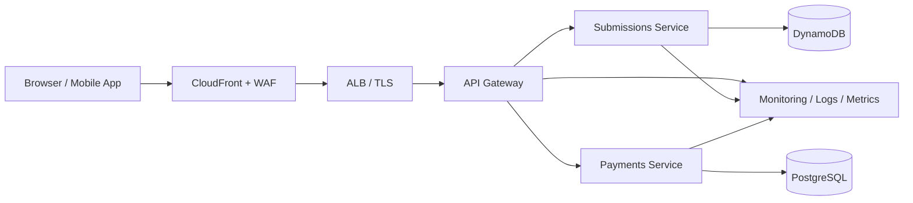

# Laundry Microservices Example

A small Spring Boot microservices demo built around an API gateway, JWT authentication, Swagger/OpenAPI, and AWS-backed microservices.

## Overview



The gateway issues and validates JWT tokens, then forwards requests to downstream services. The submissions service stores data in DynamoDB, while the payments service uses PostgreSQL on AWS. Each service exposes its own Swagger UI.

## Architecture

- Browser / Mobile App
- CloudFront + WAF
- Application Load Balancer
- API Gateway with JWT validation
- Submissions Service
- Payments Service
- DynamoDB for submissions
- PostgreSQL for payments
- Centralized logging, metrics, and tracing

## Services

| Service | Port | Purpose |
| --- | --- | --- |
| Gateway | 8080 | Authenticates JWT and routes requests |
| Submissions service | 8082 | Manages submissions |
| Payments service | 8083 | Manages payments |

## Run locally

```bash
./mvnw -f microservices/gateway/pom.xml spring-boot:run
./mvnw -f microservices/submissions-service/pom.xml spring-boot:run
./mvnw -f microservices/payments-service/pom.xml spring-boot:run
```

## Production readiness

This project is a strong microservice proof of concept, but it still needs production hardening before public deployment.

### Main improvements before production

- Add explicit CORS configuration
- Add secure response headers
- Add rate limiting and API abuse protection
- Use a secrets manager for JWT and database credentials
- Add health checks, metrics, and alerts
- Enforce stronger role-based access controls

## GitHub repository

- [Back to project README](../README.md)
- [View source on GitHub](https://github.com/your-user/laundry)

